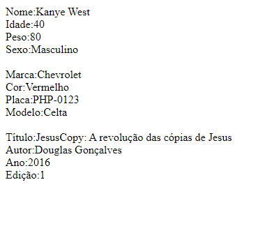

# PHP-POO-Pessoa-Carro-e-Livro-
Nesse repositório estarei colocando o exercício requisitados pelo meu professor de PHP na Etec Zona leste. Nele temos 3 classes que criam um livro, uma pessoa e um carro.

# Exibido na WEB:

